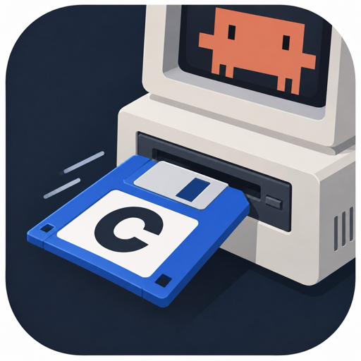

<p align="center">
  
</p>

<h1 align="center">Claude Mod Manager</h1>

Claude Mod Manager (cmod) installs and builds Claude Code mods. A mod is a Claude Code plugin built with the `@cmodjs/core` package. It can add hooks, panes, slash commands, tools, and permission rules, and it can run its own install step. cmod installs mods, runs their install and uninstall steps with your consent, and helps you build and publish your own.

## Install a mod

In Claude Code, add the mod's marketplace and install the mod:

```text
/plugin marketplace add <owner>/<repo>
/plugin install <mod>@<marketplace>
```

Claude Code installs the cmod plugin with the mod. cmod then fetches the cmod program and opens the mod's installer pane, and the mod runs its install step once you accept. The pane names each command the mod runs, each key it binds, and each permission it asks for, such as "connect to api.github.com" or "run gh on your computer". It then asks for any setting the mod needs, and walks you through any step only you can do, such as signing in. The mod can reach nothing else through cmod. A progress bar shows each step. A notice tells you when the mod is ready.

`/mods` lists every mod with its settings, its permissions, its keys, and its own pages. Turn a permission off there and the mod loses it before its next call.

A mod keeps itself up to date. Its setup turns on Claude Code's automatic updates for the marketplace it came from, unless you already chose, and the install question says so. Turn them off under `/plugin` Marketplaces. An update that changes what the mod runs asks you again before it runs.

When you remove a mod with `/plugin uninstall`, cmod runs the mod's uninstall step at the next session start or prompt. If Claude Code quits before the uninstall step finishes, the next session runs it again. If the uninstall step fails, a notice names the saved step to fix and the command that runs it again, `cmod teardown <mod>`. The mod keeps running in a session that is already open until you run `/reload-plugins` there.

In a terminal, one command does the same, for a mod or any other Claude Code plugin:

```sh
cmod install <owner>/<repo>
```

A plugin that is not a mod installs through Claude Code alone, with no consent question. `cmod update` and `cmod remove` work on any plugin the same way. The cmod plugin puts `cmod` in `~/.local/bin` the first time it runs. `cmod list` shows every plugin Claude Code has, and whether cmod set up each mod.

## What the cmod plugin runs

The cmod plugin runs three programs, and sends no data anywhere:

- **`setup/bootstrap.sh`**, the first time it runs. It runs the `cmod` launcher from the `@cmodjs/cli` package Claude Code installs with the plugin. The launcher downloads the `cmod` program for your machine from the GitHub release of this version at github.com/heyJordanParker/cmod, checks it against the release's `SHA256SUMS`, keeps it in `~/.local/share/cmod/bin/cmod/<version>/`, and links `~/.local/bin/cmod` to it. That download is its only network request.
- **`cmod teardown <mod> --events`**, when you remove a mod. At each session start and prompt, the plugin reads `enabledPlugins` from your Claude Code user settings. For each mod that left the list, it runs `cmod teardown`, which runs the uninstall step you approved when you installed the mod.
- **`cmod permission <mod> <name> [value] on|off`**, when you turn a permission on or off in `/mods`.

A setting you change in `/mods` goes to Claude Code's `/config`, the same place Claude Code keeps it when you change it there.

It writes files in two places only: the `cmod` program in `~/.local/share/cmod/` with its link at `~/.local/bin/cmod`, and the list of mods it has seen, which it keeps in Claude Code's own storage for the plugin.

Every mod built with cmod, the cmod plugin included, adds one hook on each Claude Code event a mod can use, and only a mod that decides permissions hooks Claude Code's permission check. So the cmod plugin hooks tool calls, prompts, and what Claude Code draws, and no permission check. On a tool call, the cmod plugin answers nothing of its own: it passes the event on unchanged. It never allows or denies a call, never rewrites a tool's input, and never changes a tool's output. It draws one line above the prompt while it downloads `cmod`, and it answers a call from one mod to another that names a mod you have not installed.

## Change a mod

Your changes to a mod live in its config folders, outside the mod's code. Each mod has two:

```text
~/.claude/cmods/<mod>/              yours, in every project
<project>/.claude/cmods/<mod>/      your team's, committed with the repository
```

A file in the project folder wins over the same file in yours. `CLAUDE_CONFIG_DIR` moves `~/.claude`, and removing the mod keeps both folders.

A mod's options, such as a token or a branch to watch, are yours to set in `/config`. To set them for your whole team, commit an `options.json` in the project folder that lists only the options to change:

```json
{ "branch": "release" }
```

The project's value wins over yours, and a value your organization set in managed settings wins over both. A secret never goes in the project file. The mod ignores an option it does not have and a value that does not fit, and logs one line naming the file, the option, and the fix. cmod reads the project's file when the mod starts, and again after a `/cd`.

To replace the text of a Skill a mod ships, put your own file at the same path in a config folder:

```text
~/.claude/cmods/<mod>/skills/<skill>/SKILL.md
```

Claude reads your text in place of the mod's from the next time the Skill loads, and updates keep it. cmod drops the file's frontmatter, so the mod's own name and description stay. Delete the file to get the mod's text back.

## Make a mod in 30 seconds

```sh
npm i -g @cmodjs/cli
cmod new my-mod
cd my-mod
cmod link
```

`npm i -g @cmodjs/cli` puts `cmod` on PATH, and `bun add -g @cmodjs/cli` does the same. `bunx @cmodjs/cli new my-mod` runs it once without installing. `cmod new` writes the mod and installs its packages. `cmod link` loads it in every new Claude Code session. The mod lives in `src/`:

```text
src/
├── mod.tsx                     defineMod, and the mappings: the pane, the slot renders, the hooks
├── state.ts                    the starting state, grouped by how long it lasts
├── panes/
│   └── prompts.tsx             one definePane per file
└── components/
    └── prompt-count.tsx        what the pane and the slot render draw with
```

`src/mod.tsx` attaches each part to Claude Code with one line:

```tsx
import { defineMod } from '../node_modules/@cmodjs/core/mod.js'
import { Box } from '../node_modules/@cmodjs/core/ui/elements.js'
import { slots } from '../node_modules/@cmodjs/core/ui/slots.js'
import { PromptCount } from './components/prompt-count.js'
import { promptsPane } from './panes/prompts.js'
import { initialState } from './state.js'

export const myMod = defineMod({
  name: 'my-mod',
  state: initialState,

  setup(mod) {
    mod.ui.pane(promptsPane)
    mod.ui.render(slots.AbovePrompt, ({ hasSurvey, Default }) =>
      hasSurvey ? <Default /> : <Box flexDirection="column"><Default /><PromptCount count={mod.state.session.prompts} /></Box>)

    mod.on('UserPromptSubmit', () => {
      mod.state.session.prompts += 1
    })
  },
})
```

`src/state.ts` holds the starting state:

```ts
export type MyModState = { session: { prompts: number } }

export const initialState: MyModState = { session: { prompts: 0 } }
```

`src/panes/prompts.tsx` is the mod's pane:

```tsx
export const promptsPane = definePane<MyModState>({
  id: 'my-mod',
  title: 'my-mod',
  render: (mod) => <PromptCount count={mod.state.session.prompts} />,
})
```

`src/components/prompt-count.tsx` is what the pane and the band above the prompt draw:

```tsx
export function PromptCount({ count }: { readonly count: number }): RenderElement {
  return <Text>{`Prompts this session: ${count}`}</Text>
}
```

Start `claude`, and the mod counts every prompt. `cmod check` checks the layout, the imports, and the lint, validates the mod with Claude Code, type-checks it, and runs its tests. A fresh clone has no `.claude-plugin/types/` yet, so `cmod check` has Claude Code write it before the type check. `cmod publish` releases the mod on GitHub, and prints the link that lists it in Anthropic's plugin directory.

## Docs

The mod author docs live in [core/docs/](core/docs/index.md) and ship inside `@cmodjs/core`. So every mod's `node_modules/@cmodjs/core/docs/` holds the docs of the version it installed. The `.claude/CLAUDE.md` that `cmod new` writes points coding agents there. A project plugin, made with `cmod new --project`, gets no `.claude/CLAUDE.md`.

- [index.md](core/docs/index.md): what a mod is, and which file answers which question
- [mod.md](core/docs/mod.md): `defineMod`, `setup`, and what `mod` can call
- [state.md](core/docs/state.md): state groups and Skill overrides
- [options.md](core/docs/options.md): options a person sets, typed in code, stored by Claude Code
- [permissions.md](core/docs/permissions.md): the hosts, programs, and files a mod may reach, granted by the person
- [hooks.md](core/docs/hooks.md): `mod.on`, every event, and what a hook can answer
- [ui.md](core/docs/ui.md): panes, slots, markdown slots, elements, toasts, progress, and questions
- [jobs.md](core/docs/jobs.md): slash commands, tools, permission rules, checks, prompts, schedules, status lines, and programs
- [dependencies.md](core/docs/dependencies.md): calling another mod
- [install-steps.md](core/docs/install-steps.md): install and uninstall steps, and shipping a program
- [testing.md](core/docs/testing.md): `testMod`
- [commands.md](core/docs/commands.md): every `cmod` command

## What is in this repository

- The root is the cmod plugin. It fetches the cmod program, runs the uninstall step of each mod Claude Code removes, and carries calls from one mod to another.
- [core/](core/) is `@cmodjs/core` on npm, the library every mod imports, with its docs in [core/docs/](core/docs/index.md).
- [cli/](cli/) is `@cmodjs/cli` on npm, the `cmod` command, which runs the newest cmod program. It also holds the source of the cmod program, which each GitHub release carries for macOS and Linux.
- [CONTRIBUTING.md](CONTRIBUTING.md) runs cmod from a checkout, runs the gate, and releases.

## License

MIT. See [LICENSE](LICENSE).
